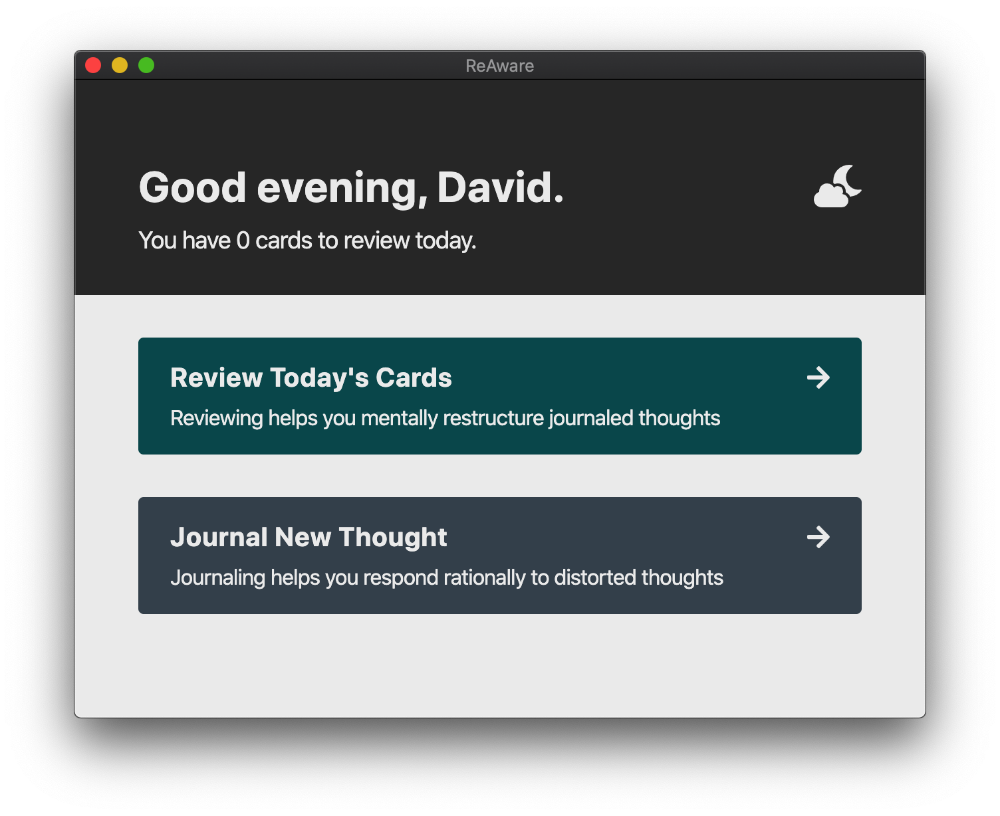

# ReAware



ReAware is an app designed to help improve your mental wellbeing, through a combination of [CBT-based techniques](https://en.wikipedia.org/wiki/Cognitive_behavioral_therapy) and [spaced repetition](https://en.wikipedia.org/wiki/Spaced_repetition).

ReAware is built with [NW.js](https://nwjs.io/), [webpack](https://webpack.js.org/), [React](https://reactjs.org/), [JSS](https://cssinjs.org/react-jss) and [PouchDB](https://pouchdb.com/), and is strongly inspired by [Anki](https://apps.ankiweb.net/).

## Development

Before starting development, make sure you've already installed [Node.js](https://nodejs.org/en/download/) and [pnpm](https://pnpm.js.org/en/installation).

### Set the environment mode

Run the following command in a terminal:

```sh
pnpm run env development
```

For production mode, replace `development` with `production` in the command above. Rerun this command whenever you want to switch mode.

Development mode enables debugging with Chrome and React DevTools, while production mode configures Webpack to produce production-optimized builds.

### Install dependencies

Run the following command:

```sh
pnpm install
```

### Building the app

Run the following command:

```sh
pnpm run build
```

In development mode, the build process stays running and watches for changes.

### Running the app

Run the following command:

```sh
pnpm start
```

In development mode, Chrome DevTools and React DevTools are enabled, and can be accessed using the keyboard shortcut F12.

## License

Licensed under the Open Software License version 3.0
